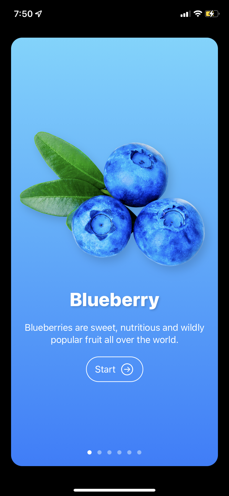
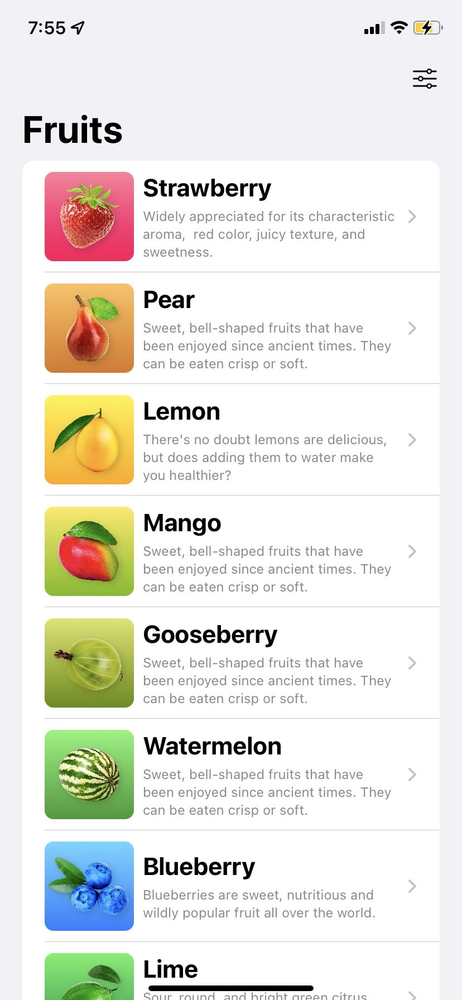
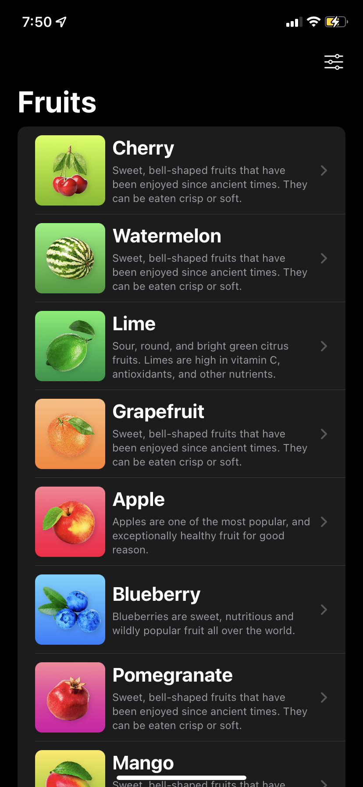
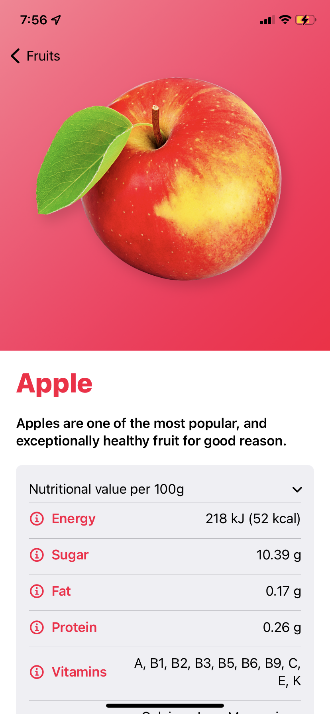
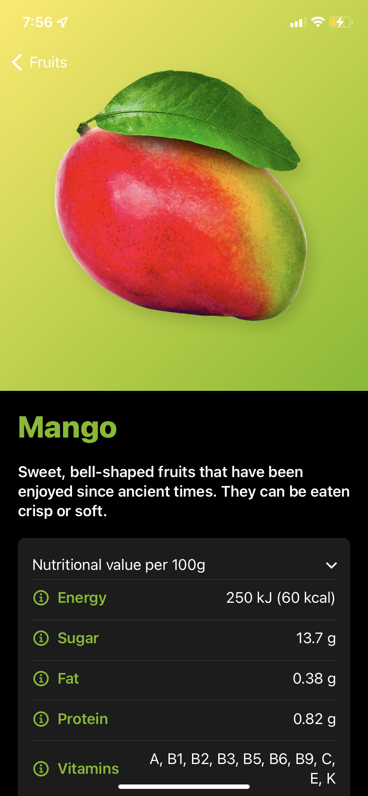
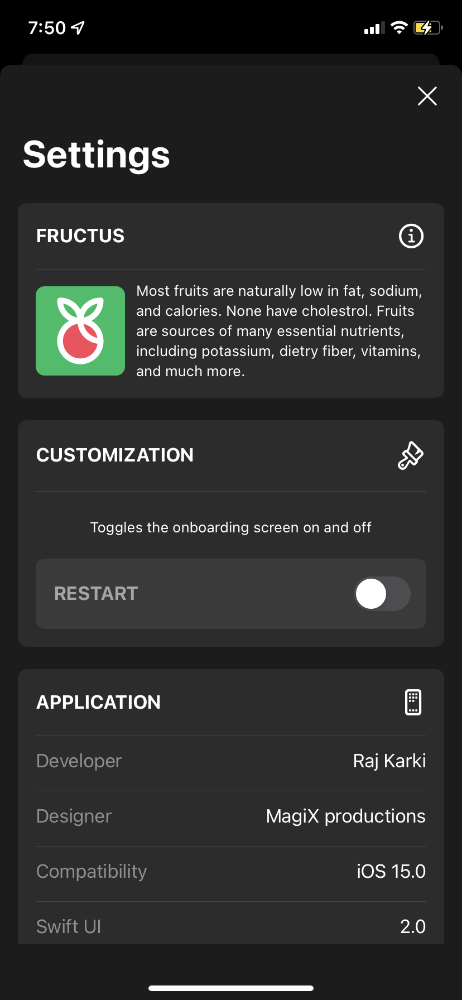

# Fructus - A fruit encyclopedia app for iOS devices 

Fructus is a colorful encyclopedia of fruits. The app gives the iPhone and iPad users information about different types of fruits. 
The app provides nutritional value of fruits (per 100g) such as energy, sugar content, fat content, protein content, vitamims and minerals. The encyclopedia contains description of a fruit along with other information such as the origin of the fruit, culinary uses, and cultivation. 

## Documentation

[Documentation](#documentation)
[Features](#features)
[Demo](#demo)
[Screenshots](#screenshots)

## Features

- Light/dark mode toggle
- iPhone & iPad compatible
- Restart the application

## Demo
### Dark Mode
 

### Light Mode
 

## Screenshots
### Onboarding Screen

Onboarding Screen is a welcome screen for users to give context of the app as well as short description of the app. The onboarding screen is displayed only the first time the app is opened. To view the onboarding screen, the user has to restart the appliction.

### Fruit List 

 

 
 
Fruit List View displays the list of all the apps. 

### Details View

 

 
Details view, as the name implies, lists all the details about the app. 

### Settings View

The settings view has a toggle to restart the application. It also displays the development environment.

## Authors

- [@RajanishKarki](https://github.com/Whacko23)

## 🔗 Links

## Feedback

If you have any feedback, please reach out to us at itsme.rajanish@gmail.com

